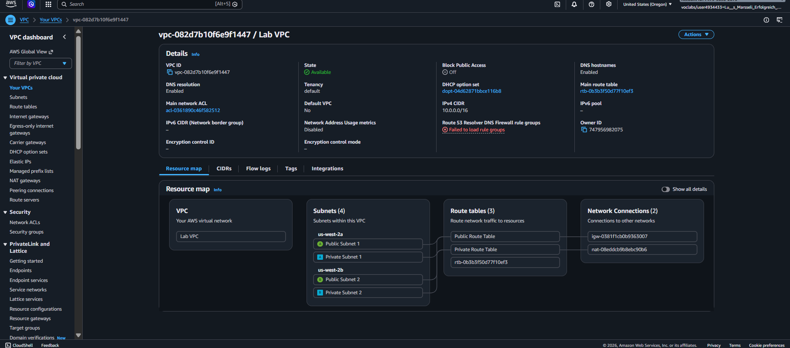
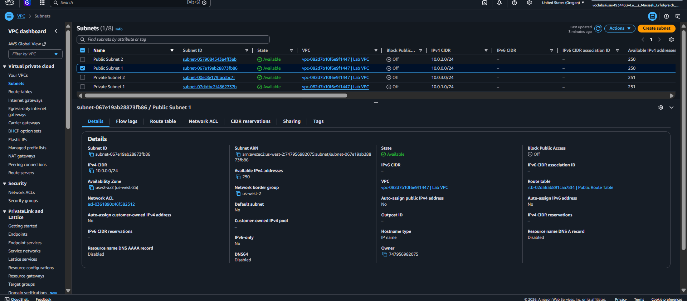
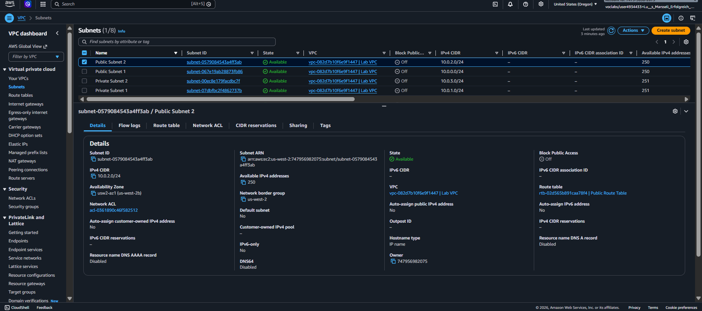
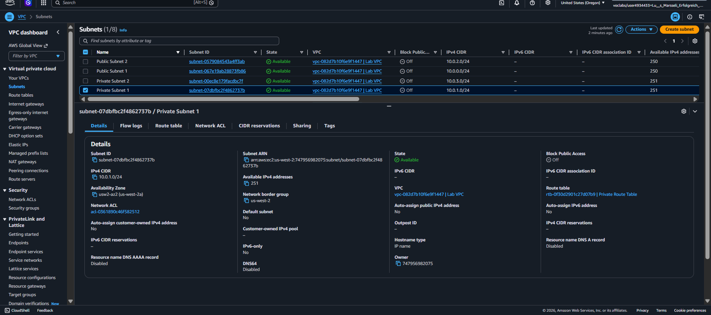
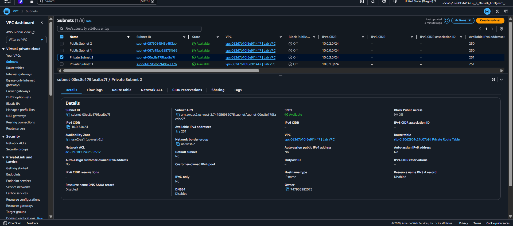
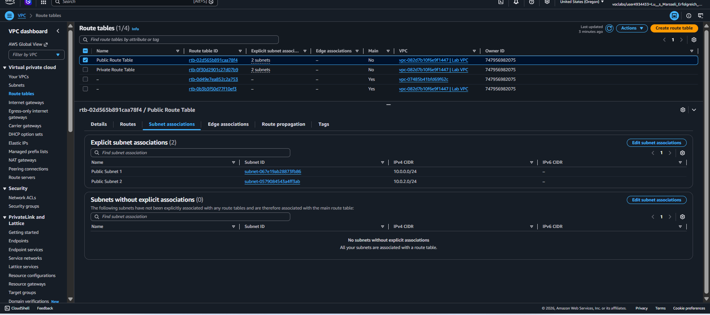
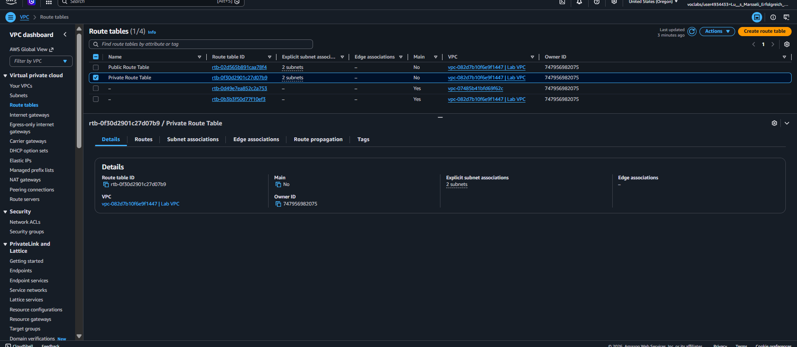
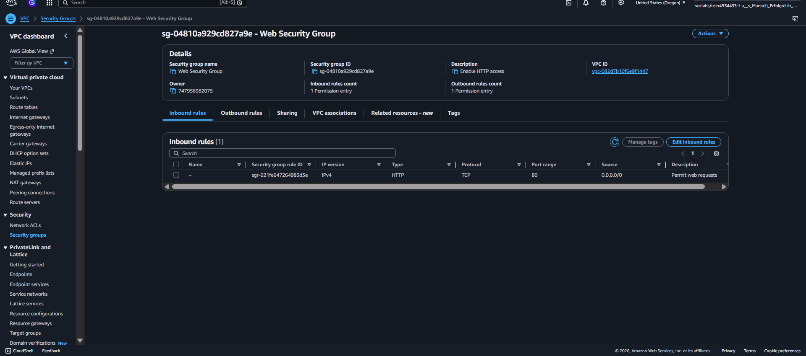
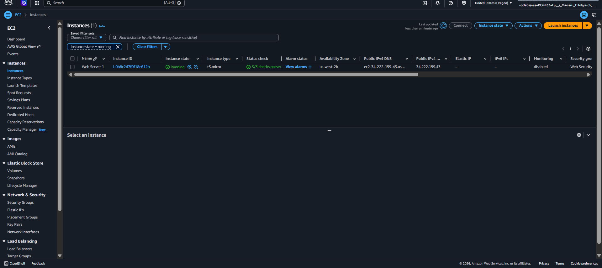
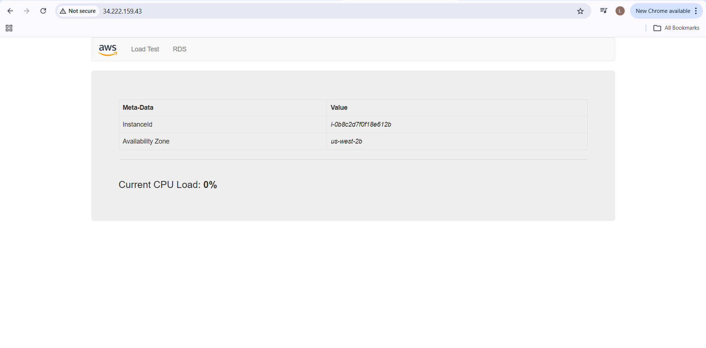

# aws-vpc-ec2-webserver
# AWS Project – VPC Architecture with EC2 Web Server

Criação de uma infraestrutura completa na AWS utilizando VPC, sub-redes públicas e privadas, tabelas de rotas e Internet Gateway.

## Etapas realizadas

* Criação de VPC personalizada
* Configuração de sub-redes públicas e privadas
* Associação de tabelas de rotas
* Criação de Security Group com liberação de HTTP
* Provisionamento de instância EC2
* Configuração de servidor web (Apache)

## Arquitetura

Este projeto implementa uma arquitetura simples contendo:

- VPC com CIDR 10.0.0.0/16
- Subnets públicas e privadas
- Internet Gateway para acesso externo
- NAT Gateway para saída de subnets privadas
- Security Group permitindo HTTP (porta 80)
- Instância EC2 com servidor Apache

## Tecnologias utilizadas

* AWS VPC
* AWS EC2
* Amazon Linux 2023
* Apache

## Objetivo

Simular um ambiente de infraestrutura em nuvem com acesso público a uma aplicação web.

## Aprendizados

- Configuração de redes na AWS (VPC, subnets e rotas)
- Controle de acesso com Security Groups
- Deploy de aplicação em EC2
- Noções de alta disponibilidade

## Melhorias futuras

- Implementar Load Balancer
- Criar Auto Scaling Group
- Migrar para infraestrutura como código (Terraform)
- Monitoramento com CloudWatch
  
## Observação

Projeto desenvolvido em ambiente de laboratório com evidências registradas por capturas de tela.

## Evidências

### VPC criada

### Subnets públicas

### Subnets privadas

### Tabelas de rotas

### Security Group (HTTP liberado)

### Instância EC2 rodando

### Servidor web funcionando

